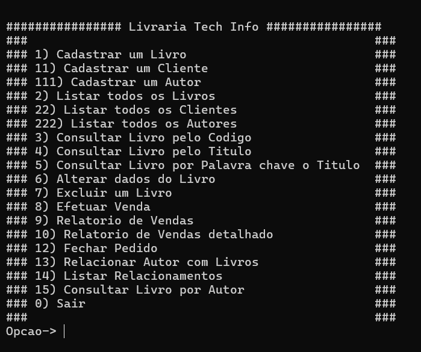
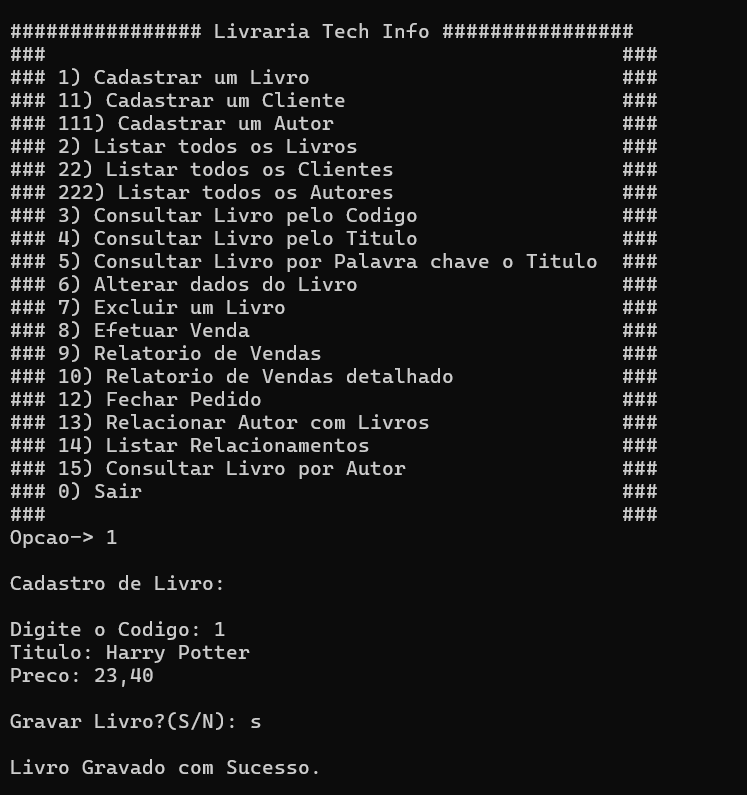

<h1 align="center"> Sistema de Biblioteca em C </h1>

## :memo: Descrição
Este projeto consiste no desenvolvimento de um sistema para gerenciamento de uma biblioteca. O sistema possui funcionalidades para cadastro, listagem, consulta, edição e exclusão de registros de livros, clientes e autores, além de gerenciar vendas e relacionamentos entre autores e livros. Com estas funções, o sistema possibilita uma administração eficiente da biblioteca, promovendo um gerenciamento completo dos recursos.

## :books: Funcionalidades
- **Livros**
  - Cadastro de livros
  - Listagem de todos os livros
  - Consulta de livro por código ou título
  - Edição de informações do livro
  - Exclusão de livro

- **Clientes**
  - Cadastro de clientes
  - Listagem de todos os clientes
  - Consulta de clientes por código

- **Autores**
  - Cadastro de autores
  - Listagem de todos os autores
  - Relacionamento de autores com livros

- **Vendas**
  - Cadastro de vendas
  - Relatório de vendas detalhado
  - Fechamento de pedidos

## :wrench: Tecnologias Utilizadas
- Linguagem de programação: C
- Manipulação de arquivos para armazenamento dos dados (livros, clientes, autores, vendas)

## Estrutura do Projeto

- **Manipulação de Arquivos**: Dados são armazenados em arquivos binários (`.dat`) para persistência.
- **Structs**: Estruturas organizadas para cada entidade:
  - `reg_livro`: Representa um livro
  - `reg_cliente`: Representa um cliente
  - `reg_venda`: Representa uma venda
  - `reg_autor`: Representa um autor
  - `reg_RelaAutorLivro`: Representa o relacionamento entre autores e livros

## 📷 Preview

## Menu Principal do Sistema

## Cadastro de Novo Livro

## 🧑‍🏫 Aprendizados
Durante o desenvolvimento deste projeto, aprendi muito sobre manipulação de arquivos em C, incluindo leitura, escrita e busca de registros em arquivos binários. Aprimorei minhas habilidades em programação estruturada, criando um sistema que gerencia dados de maneira eficiente e prática. Cada funcionalidade, como cadastro, edição e consulta, exigiu a implementação de algoritmos para garantir a consistência e integridade dos dados, além de proporcionar uma boa experiência ao usuário.

---
